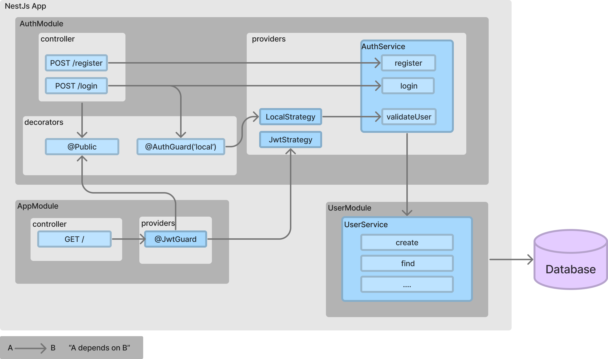

# 用户鉴权模块实现



- 用户处于未登录状态，当用户使用各种方式进行登录（账号密码登录、第三方登录），api服务根据用户当前的登录方式使用不同的策略验证用户：
  - 当前验证方式没验证通过，告知用户
  - 当前验证方式验证通过，签发jwt给用户进行保存，用以访问受保护的服务资源
- 用户处于登录状态，当用户使用jwt去访问服务资源的时候，使用JwtStrategy策略验证用户jwt
  - Jwt验证没验证通过，告知用户
  - Jwt验证验证通过，返回受保护的资源

需要鉴权的功能，先经过guard处理鉴权，鉴权通过后才进入controller进行相关路由匹配处理，再接着才进行对应的业务逻辑处理。、

但是注意，对于login这个方法是不需要进行鉴权的。

注册：我是谁，我要加入系统

登录：我是谁，我要进入系统

鉴权：我是谁，我在这个系统有哪些权力

“认证”是一个大的话题，不同的认证策略的认证方式都不太一样，常见的认证策略有：

- 用户名+密码认证
- jwt认证
- oauth认证

我们可以通过使用guard机制去实现api访问限制的功能，来达到用户必须传递有效的jwt才能够访问被保护的api的效果。

1. 实现auth guard守卫，拦截用户请求
2. 实现jwt模块进行新用户jwt的生成和已有用户jwt的验证，达到认证的目的
    1. 实现jwt生成
    2. 实现jwt校验
3. 为了能让auth guard用起来，需要在对应的地方，比如Controller使用守卫拦截器放置对应的Auth Guard，让auth guard的守卫效果生效。

整个过程，先guard鉴别api访问权限，然后pipe管道验证用户传递数据，最后使用controller对应的api处理程序。

- 两个应用jwt的地方：
  - 验证用户，发放jwt
  - 验证jwt，返回资源


引入PassportModule，是因为它会被JwtModule内部引用到，更准确来说是引用定义的JwtStrategy（它属于PassportModule）。JwtModule会利用其来做签名和校验，其中校验的时候就是利用的JwtStrategy的validate方法，其实际内部又利用到了passport+passport-jwt包的verify方法。

- **创建passport策略**：Passport策略分类（使用策略的前提：对于选择的 **任何** `Passport` 策略，都需要安装 `@nestjs/Passport` 和 `Passport` 包）

    ```bash
    pnpm install --save @nestjs/passport passport
    ```

  - local策略：实现了一种用户名/密码身份验证机制

        ```bash
        pnpm install --save passport-local
        pnpm install --save-dev @types/passport-local
        ```

        ```tsx
        import { Inject, Injectable } from '@nestjs/common'
        import { PassportStrategy } from '@nestjs/passport'
        import { ExtractJwt, Strategy } from 'passport-jwt'

        import { ISecurityConfig, SecurityConfig } from '~/config'

        import { AuthStrategy } from '../auth.constant'

        @Injectable()
        export class JwtStrategy extends PassportStrategy(Strategy, AuthStrategy.JWT) {
          constructor(
            @Inject(SecurityConfig.KEY) private securityConfig: ISecurityConfig,
          ) {
            super({
              jwtFromRequest: ExtractJwt.fromAuthHeaderAsBearerToken(),
              ignoreExpiration: false,
              secretOrKey: securityConfig.jwtSecret,
            })
          }

          async validate(payload: IAuthUser) {
            return payload
          }
        }
        ```

  - jwt策略：

        ```bash
        pnpm install --save passport-jwt
        pnpm install --save-dev @types/passport-jwt
        ```

        ```tsx
        import { Strategy } from 'passport-local';
        import { PassportStrategy } from '@nestjs/passport';
        import { Injectable, UnauthorizedException } from '@nestjs/common';
        import { AuthService } from '../auth.service';

        @Injectable()
        export class LocalStrategy extends PassportStrategy(Strategy) {
          constructor(private authService: AuthService) {
            super();
          }

          async validate(username: string, password: string): Promise<any> {
            const user = await this.authService.validateUser(username, password);

            if (!user) {
              throw new UnauthorizedException();
            }

            return user;
          }
        }
        ```

- **注册passport策略**：定义完成对应的passport strategy类还不够，我们还需要在AuthModule添加两个地方才能够启用我们刚刚定义的passport strategy的功能。

    ```tsx
    import { Module } from '@nestjs/common';
    import { AuthService } from './auth.service';
    import { UsersModule } from '../users/users.module';
    import { PassportModule } from '@nestjs/passport';
    import { JwtStrategy } from '.jwt.strategy';

    @Module({
      imports: [UsersModule, PassportModule], // 1.加入PassportModule模块
      providers: [AuthService, JwtStrategy], // 2.加入刚定义的passport strategy类
    })
    export class AuthModule {}
    ```

- **使用passport策略**：将对应策略当成AuthModule的provider引入。然后当设置对应的APP_GUARD时，使用JwtAuthGuard，内部是就会自动应用JwtStrategy策略类（内部其实实现是`class JwtAuthGuard extends AuthGuard('jwt')` ，其中`AuthGuard('jwt')` 意思是使用jwt策略）。每种策略的 `validate()` 方法的差异就是如何确定用户是否存在和是否有效。

    ```tsx
    @Module({
      imports: [
        PassportModule,
        JwtModule.registerAsync({
          imports: [ConfigModule],
          useFactory: (configService: ConfigService) => {
            const { jwtSecret, jwtExprire } = configService.get<IAuthConfig>(
              ConfigGroup.Auth,
            );

            return {
              secret: jwtSecret,
              expires: jwtExprire,
              ignoreExpiration: false,
            };
          },
          inject: [ConfigService],
        }),
        UserModule,
      ],
      providers: [
      JwtStrategy,
        {
          provide: APP_GUARD,
          useClass: JwtAuthGuard,
        },
      ]
    })
    export class AuthModule
    ```

## 不同登录状态的认证鉴权需求

- 用户未登录：进行登录、注册、其他api调用
  - `/api/auth/login` 调用`authService.login()` 。查询用户信息，验证用户信息（如何验证用户token有效？），返回token
    - 校验用户传递的登录信息（nest pipe）
    - 校验通过后，使用controller对应的signin处理对应的/auth/login的路由。在AuthModule中使用UserModule的UserService查询用户是否存在
    - 集成nestjs jwt功能
      - 由于用户信息需要交给nestjs jwt模块做校验认证，但是jwt模块是不知道需要使用什么校验策略的，因此需要提前定义校验策略类，如local.strategy.ts
      - 将用户的信息交给nestjs jwt模块去做认证，内部会调用校验策略类的validate方法对用户信息进行校验。如果用户认证通过，生成一个新的jwt
  - `/api/auth/register`调用`authService.register()` 。查询用户信息，创建新用户
    - 创建新用户之前，需要校验用户传递的创建信息（这里就是nestjs pipe管道的应用场景：验证业务数据 ，主要验证业务逻辑，如密码需要6位以上 。nestjs pipe管道会由controller的路由处理程序处理，在调用路由处理方法之前，先插入pipe管道校验传递的参数（dto））
    - 校验通过后，在AuthModule中使用UserModule的UserService查询用户是否存在
      - 存在，抛出异常
      - 不存在，调用UserService创建一个新的用户（相关联：密码的保存需要加密保存，而且需要一定的手段来保存来对抗彩虹表攻击
  - `/api/module` ，使用Guard守卫拦截，验证用户信息（如何验证用户token有效？），验证通过后进行api处理，否则报错返回给前端
- 用户已登录：进行其他api调用
  - `/api/module` ，使用Guard守卫拦截，验证用户信息（如何验证用户token有效？），验证通过后进行api处理，否则报错返回给前端

## Nestjs中创建Guard守卫应用于API访问权限场景

1. 全局配置守卫

    ```tsx
    @Module({
      imports: [ConfigModule, DatabaseModule, AuthModule, UserModule],
      providers: [
        { // 全局配置开启Auth守卫，所有的api controller处理之前都需要经过AuthGuard守卫进行拦截处理
          provide: APP_GUARD,
          useClass: JwtAuthGuard,
        },
      ],
    })
    export class AppModule {}
    ```

2. 定义AuthGuard守卫的逻辑
    - 如果是api处理程序带有@Public，说明是公共接口，不需要认证和鉴权就可以使用，直接返回true放行

    ```tsx
    @Injectable()
    export class JwtAuthGuard extends AuthGuard('jwt') { //  AuthGuard('jwt')意思是使用jwt策略
      constructor(private readonly reflector: Reflector) {
        super();
      }

      async canActivate(context: ExecutionContext): Promise<boolean> {
        // 1.公共接口判断：带有@Public()装饰器的接口不需要验证
        const isPublic = this.reflector.getAllAndOverride<boolean>(IS_PUBLIC_KEY, [
          context.getHandler(),
          context.getClass(),
        ]);

        if (isPublic) {
          return true;
        }

        const token = '';
        if (!token) {
          throw new UnauthorizedException();
        }

        try {
        } catch {
          throw new UnauthorizedException();
        }
        return false;
      }
    }
    ```

## Nestjs中创建Pipe管道应用于数据校验场景

1. 全局配置管道

    ```tsx
    app.useGlobalPipes(
      new ValidationPipe({
        transform: true,
        whitelist: true, // 去除在类上不存在的字段
      }),
    )
    ```

2. 创建class类，即Entitiy，DTO

    ```tsx
    export class SigninUserDto {
      username: string;
      password: string;

    ```

3. 设置校验规则

    ```tsx
    import { IsString, IsNotEmpty } from 'class-validator';

    export class SigninUserDto {
      @IsString()
      @IsNotEmpty()
      username: string;

      @IsString()
      @IsNotEmpty()
      password: string;
    }
    ```

4. 使用class类，即Entitiy，DTO

    ```tsx
    @Controller('auth')
    export class AuthController {
      @Post('/login')
      async login(@Body() sininUserDto: SigninUserDto) {
        console.log('🚀 ~ AuthController ~ login ~ sininUserDto:', sininUserDto);
        return 'login';
      }
    }
    ```

## 密码处理


    即使密码经过了Hash处理，依然是存在风险的，比较著名的一种攻击方式就是彩虹表。

    

    彩虹表攻击的方式是：准备一张表常见的原始密码及其hash值，然后向数据库发送hash值比对数据库当中存储的用户密码hash值，如果比对成功，则可以返回来知道原始密码。

    处理该攻击的方式是：在往数据库中存储用户的密码时加盐，让盐和密码的hash再进行计算得到一个新字符串才存储到数据库中，加大攻击成本。

## 装饰器执行顺序

    只要前边的装饰器执行不通过，后边的都不会执行，类似于熔断机制（tapable的熔断hook）

    - 从下往上 ⬆️
    - 从左往右 ➡️

## 疑问

    - 为什么要在AuthModule当中导入PassportModule？

        `import { PassportModule } from '@nestjs/passport';`

        为passport这个库做一个nest中间件。

    - 为什么要在AuthModule当中导入JwtModule？

        `import { JwtModule } from '@nestjs/jwt';`

        为了在nestjs中使用jwt功能
